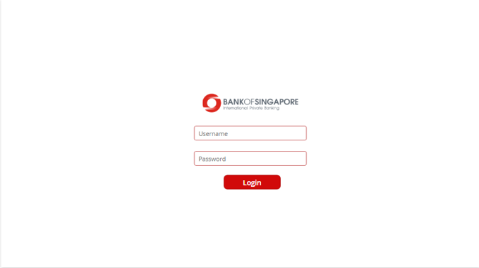
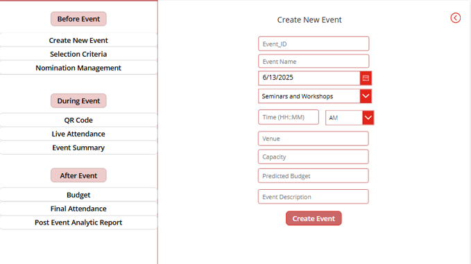
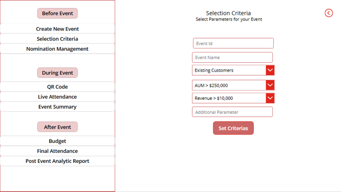
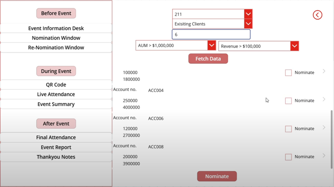
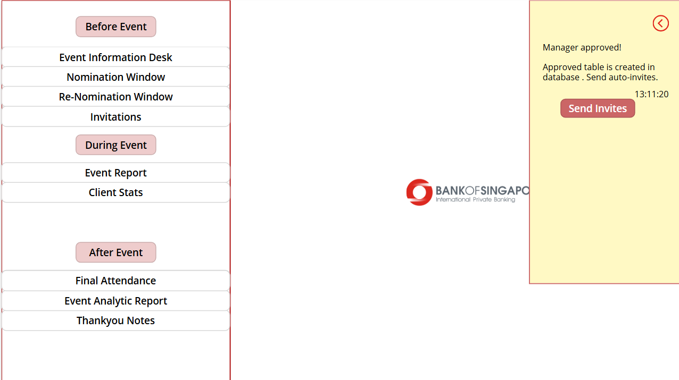
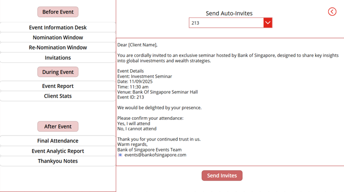
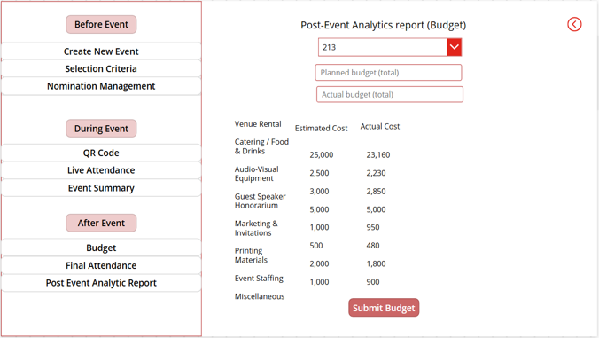
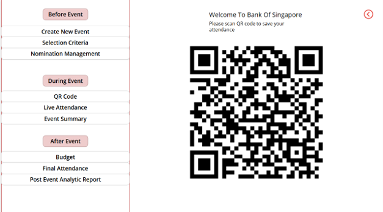
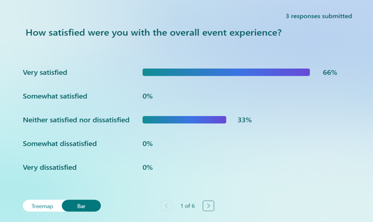

# 🌟 Evanza — Smart Event Nomination Platform for Banks

Evanza is a secure, end-to-end platform designed to help banks seamlessly plan events, filter and nominate the right clients, track attendance, and analyze post-event impact — all within a unified Microsoft-powered ecosystem.

---

## 🚀 Why EvAnza?

### 🔹 Built for Banking
EvAnza was created with strict banking-grade standards in mind. It leverages Microsoft technologies to ensure data security, scalability, and reliability across every stage of event planning and execution.

### 🔹 Unique Value Proposition
- **End-to-End Event Lifecycle Management** — from creation to post-event analytics
- **AI-like Filtering Logic** — based on real-time financial metrics like AUM and Revenue
- **Dynamic Re-Nomination Engine** — *Automatically excludes declined clients and reprioritizes top prospects for 100% event fill rate.*
- **QR-Based Secure Attendance** — with validation, tracking, and analytics
- **Data-Driven Feedback Loops** — post-event insights drive future decisions

---

## 🎯 User Journey (Screens & Modules)

### 1️⃣ Login Page
Secure user authentication with **role-based dashboards**:
- 👤 Banker
- 📅 Event Manager
- 👔 Manager

> 🔐 *All workflows enforce role-based access control (RBAC) — bankers, managers, and event teams see only permitted data.*

*

---

### 2️⃣ Event Manager Dashboard

#### a. **Create New Event**
Define and register event parameters. Each event gets a **unique Event ID**.

* 

#### b. **Set Selection Criteria**
Choose client type (Prospect or Existing), define **AUM & Revenue thresholds** to auto-generate a qualified client shortlist.

* 

---

### 3️⃣ Banker Dashboard

#### a. **View Event Information**
Bankers select an event ID to view its full detail and selection filters.

#### b. **Nominate Clients**
- Fetch top N clients matching selection logic.
- View data in gallery format.
- Nominate using a dropdown.

*

#### c. **Notifications & Auto-Invites**
Bankers are notified when nominations are approved  via notification system of evanza and can **auto-send invites**.
*
*

#### d. **RSVP & Re-Nomination**
- Invited clients respond via email.
- If declined, bankers **re-nominate** from a refined list (auto-excludes declined clients using the Dynamic Re-Nomination Engine).

---

### 4️⃣ Manager Dashboard

#### a. **Approval Window**
Managers review nominations and **approve or reject** each client. Final decisions are pushed to bankers.

#### b. **Post-Event Analytics**
- **Attendance Summary** (auto-recorded via QR code)
- **Feedback Reports** (via Microsoft Forms)
- **Budget vs Actual Cost Comparison**

*

---

## 📲 During the Event

### ✅ QR Code-Based Check-In
Each event has a unique QR code. Clients scan it, submit their phone number, and attendance is recorded in real-time.

> **Real-time attendance validation via Microsoft Forms**, blocking unauthorized entries and maintaining tamper-proof logs.

*

---

## ✉️ Post-Event Engagement

- Automatic **thank-you emails** sent to attendees.
- Feedback forms to evaluate satisfaction and gather suggestions.
- Manager dashboard reflects this data for **continuous improvement**.

*

---

## 📊 Sample Insights

> ✅ *66% of attendees marked "Very Satisfied" in feedback survey*  
> 🔄 *Re-nomination flow helped fill 100% of target guest list post rejections*  
> 💰 *Event budget variance reduced to <5% through real-time cost tracking*

---

## 🛠️ Built With

- **Power Apps** – Front-end UI logic and role-based workflows
- **Azure SQL** – Centralized storage for nominations, approvals, and attendance with **bank-grade encryption**
- **Microsoft Forms** – Secure attendance tracking and feedback collection
- **Power Automate** – Workflow automation, real-time notifications, and invites

---

## 🧠 Why It Matters

✅ **Eliminates manual Excel workflows**  
✅ **Accelerates client outreach by 70%**  
✅ **Improves targeting with data filters**  
✅ **Fully integrated, no-code/low-code Microsoft stack**  
✅ **Ideal for private banking teams and relationship managers**

---

## 📌 Note to Judges

> This repository includes logic, schemas, and real data flows implemented across Power Apps and Azure SQL.  
> All screens shown reflect real UI built for the working prototype.  
> **All workflows enforce strict role-based access (RBAC)** to ensure each team sees only what they are permitted to manage.

---

## 🔗 Important Links

- **[Pitch Video]()** ← _Add link here_
- **[UI/UX Design – Take a Look (Very Important)](Bank%20Of%20Singapore%60%20(1).pptx)**
- **[LinkedIn Profile](https://www.linkedin.com/in/astha-pipania-b91129281/)**

---

## 🏁 Final Thoughts

EvAnza isn’t just another form-filling app. It’s a vision for smarter, faster, and more secure client engagement in financial services. From strategic shortlisting to intelligent re-nomination and real-time analytics, EvAnza helps banks elevate their events from routine to remarkable.

---
